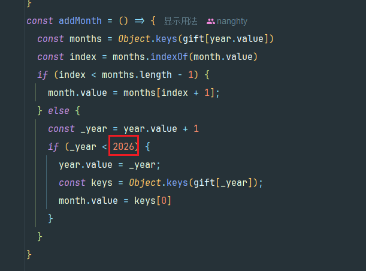

# 小栞的主页  

使用 vite + vue3 + element-plus  
先写到这、有空再补


运行项目要求
1. 下载node至少22版本  
https://nodejs.org/zh-cn/download    
windows系统下载.msi即可  
2. 进入项目根目录、执行```npm install```  
3. 调试项目 执行 ```npm run dev``` 命令行窗口会提示你打开 http://localhost:5173
4. 编译项目 执行```npm run build`` 会在根目录生成dist文件夹，里面的文件就是你需要的

# 新增歌单
只需要在 ```src/assets/songs.js``` 和 ```src/assets/songs_jp``` 中添加即可，tag会自动识别

# 新增舰礼
只需要在对应文件夹里放入图片，并在```src/assets/gift.js```里配置好即可。 年份、月份会自动识别  
有一点需要注意的是，新增年份的话，需要修改这个值，防止点击下一个月切换不了


# 新增音频
只需要将录制的mp3文件放在 ```src/assets/voice/``` 目录下，并在 ```src/assets/voice.js```中配置即可
